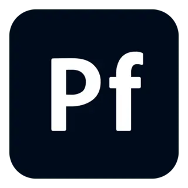

  
  <h1>Personal Portfolio</h1>
  
A modern, responsive personal portfolio website built with Bootstrap 5

  <a href="https://throni001.github.io/Personal-Portfolio/"><strong>View Live Demo →</strong></a>
    
  
  
  
  

---

## Navigation

| Page | Link |
|------|------|
| Home | [`index.html`](index.html) |
| About Me | [`about.html`](about.html) |
| Portfolio | [`portfolio.html`](portfolio.html) |
| Services | [`service.html`](service.html) |
| Contact | [`contact.html`](contact.html) |

---

## About

This is a personal portfolio website for **Tanzil Hasan** — a Junior Full-Stack Developer with 4+ years of experience. The site showcases skills, projects, services, and provides a way for potential clients to get in touch.

### Sections

- **Hero** — Introduction with stats (years exp, projects, clients)
- **Mission & Vision** — Core values and goals
- **Services** — Web Dev, Mobile Apps, UI/UX Design
- **Testimonials** — Client feedback carousel
- **Footer** — Quick links, contact info, newsletter signup

## Built With

- **Bootstrap 5.3** — Responsive layout & components
- **Bootstrap Icons** — Icon set
- **HTML5 & CSS3** — Structure & custom styling
- **JavaScript** — Interactive features

## Live Demo

👉 [**throni001.github.io/Personal-Portfolio**](https://throni001.github.io/Personal-Portfolio/)

---

  
Made with ❤️ by <a href="https://github.com/throni001">Tanzil Hasan</a>

